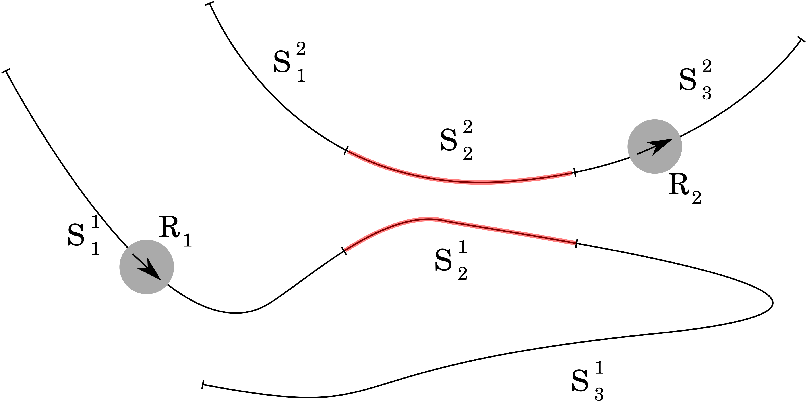

## MMRS Simulator

This simulator models the movement of a group of mobile robots (MMRS - Multiple Mobile Robot System) along given paths. Unlike other similar solutions, such as *Stage*, *Gazebo* or *V-REP*, this simulator igores the geometry of paths. Hence, it can be used to test high-level supervisors that control the simultaneous movement of large groups of robots in a manner preventing collisions and deadlocks between theese vehicles. 

#### Problem statement

In our task we consider a group of heterogeneous mobile robots working in a common 2D workspace. Each vehicle is represented as a disk with radius *r*, which fully covers it. Vehicles functionality is significantly restricted - they can only accelerate forward and deceletare (until they stop), but moving backwards is impossible. Each robot has a path to complete. The paths are divided into separate sectors. A sample task is shown in **Figure 1**.

*__Figure 1:__ Example of paths divided into sectors.*
It presents 2 robots - *R1* and *R2* on their paths. Both paths are divided into sectors described as *Sij*, where *i* denotes path ID and *j* denotes sector position on that path. If 2 sectors belonging to 2 different paths are too close (shortest distance between them is less than *2r*), we mark them as *conflict sectors* (red areas on **Figure 1**). Each sector can have any number of other sectors that conflict with it (this number is limited only by integer capacity). The task of the robots is to travel from the beginning to the end of their path in a finite time. If at any time during the simulation, 2 robots will be simultaneously in 2 conflicting sectors, the task ends in failure.

#### Input data

Paths can be divided into sectors in any way. Some divisions will be more effective, others less, but the process of division itself is carried out by other software. Simulator takes already divided paths, along with the determined conflict relations as input data. The path is represented as:
- a list of positive real values, representing distances between endpoints of successive sectors and starting point of the path (this is the path length, not the Euclidean distance between 2 points in 2D. The input data doesn't contain **any** information about path geometry)
- lists containing ID's of colliding sectors for any sector that has at least one of them. 

Additionally, a robot is assigned to each path. It is described using the following parameters:
- radius *r*,
- velocity *(m/s)*,
- acceleration *(m/s2)*,
- deceleration *(m/s2)*.

The task described in this way contains full information required by the simulator. 

#### Special points and events 

*__Figure 2:__ Special points of a sector.*
For each sector, we define some *special points* lying on the path. They are shown in Figure 2.  At a distance of *r* after the end of the sector lies the *release point* (*rp*), indicating the place where robots disk no longer overlaps the previous sector. The *critical point* (*cp*) lies at the safe distance (*r + bd*) before the beginning of a sector, where *bd* denotes a *braking distance* - maximum distance needed for the robot to slow down and eventually stop. If the robot starts braking at *cp*, it will not enter the next sector. Reaching *cp* and *rp* by the robot results in sending a message containing its ID to the appropriate ROS topic. This message can be read by the supervisor, deciding which vehicle should obtain *movement permission*. *Movement permission* is a one-time permit for passing to the next sector. Such permits can be sent by the supervisor multiple times, and each robot counts permits granted to it. When the *cp* point is reached, if the permission counter of the given robot is 0, it begins to brake and eventually stops, waiting for the permission from the supervisor. Otherwise, one of the permits is consumed - the robot continues without braking, and the permit counter is decremented. This gives the supervisor full control over entering next stages by the vehicles. Such control is necessary to avoid collisions between vehicles.

#### Summary

The simulator models the progress of robots on their paths, implementing their simplified dynamics. It provides its interface through ROS topics, used for sending and receiving information about events in our system. Presence of the supervisor sending *movement permissions* is necessary for the correct simulator behavior. Otherwise all robots will stop at the first *critical point*.

